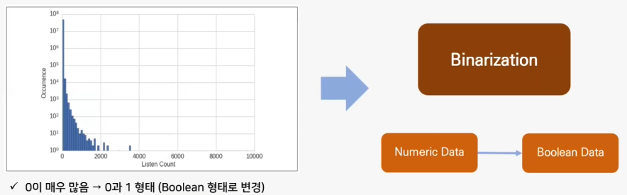

# 데이터 엔지니어링
- Feature Engineering
- 중요한 파트 !!

### 1 . 머신러닝에서의 데이터 정제

- 데이터 구분
 
 - 수치형 데이터와 범주형 데이터의 전처리 방법이 다르다.

### 2 . 수치데이터 데이터 정제
- Count Data, Log Transformation, Scaling, Interaction, Selection

2-1 Count Data

- ex) 사용자별 음악 청취 수, 사용자별 클릭 건수, 리뷰 건수 등(휴먼 계정, 소극적인 계정들의 비율이 있을 것이므로 0건의 개수가 많을 것이다.)
- Binning에는 단순히 0과 1의 이분법적 그룹화 말고도, Quantile Binning 처럼 사분위수로 그룹화할 수도 있다.

  2-2 Log Transform

- data들을 로그변환하여 보다 정규화하게 만들 목적과 오차를 줄여줄 목적으로 수행함.
- ex) 국민 연봉 분포(평균 근처에 몰려있고, 상위로 길게 늘어진)

2-3 Scaling

- Scaling은 데이터의 특성(feature)들을 일정한 범위로 조정하는 작업을 의미함.  

2-3-1 **min-max Scaling**

- 모든 수치 데이터들을 0과 1사이에 몰아 넣음
- What for? 독립변수들의 단위가 다를 때 사용함(feet, kilometers, hours, 100 cm = 1 m)

2-3-2 **Standardization (Variance Scaling)**
- 데이터를 평균이 0이고 표준 편차가 1인 정규분포를 따르는 값으로 변환. 대체로 연속형데이터일 경우 웬만하면 해주는 것이 좋다.

2-3-3 L^2 Normalization

- 이상치들까지 잡아서 한 원에 다 넣는 정규화 라고 생각하면 된다.
- 자주 쓰지 않는 것으로 이런 것이 있다 정도로 넘어가면 되겠다.

### 3 . 범주형 데이터 정제
- Encoding, Feature Hashing, Bin Counting
- **원-핫 인코딩 (One-Hot Encoding):** 범주형 변수를 이진 형태로 변환하는 방법으로, 각 범주를 새로운 열로 만들고 해당 범주에 해당하는 경우 1을, 나머지 경우에는 0을 할당합니다. 이는 범주 간의 순서나 상대적 크기를 고려하지 않을 때 사용합니다. 
- **Label Encoding:** 범주형 변수의 각 범주를 숫자로 변환하는 방법입니다. 하지만 숫자의 크기나 순서를 고려하기 때문에 범주 간의 관계를 제대로 표현하지 못할 수 있습니다.
- Target Encoding (Mean Encoding): 범주별로 타겟 변수의 평균값을 대체하는 방법입니다. 주로 분류 문제에서 사용되며, 범주형 변수의 정보를 보존하면서도 숫자 형태로 변환합니다.
- Frequency Encoding: 범주별로 해당 범주가 데이터셋에서 나타난 빈도수로 대체하는 방법입니다. 범주의 빈도가 높을수록 더 큰 값을 가집니다.
- **Ordinal Encoding:** 범주 간의 순서 또는 계층적 관계를 고려하여 범주를 숫자로 매핑하는 방법입니다. 예를 들어 학력 수준처럼 순서가 있는 범주형 변수에 적용될 수 있습니다.
- Dummy Variables: 일부 경우에 범주형 변수를 0과 1의 값을 가지는 여러 열로 변환합니다. 이는 원-핫 인코딩과 유사하지만, n-1개의 열만 생성하여 차원을 줄입니다.

### 4 . 요약
- 수치형 데이터 : Min-Max Scaler, Standard Scaler
- 서열척도 : LabelEncoder, OrdinalEncoder
- 명목척도 : One-Hot Encoder