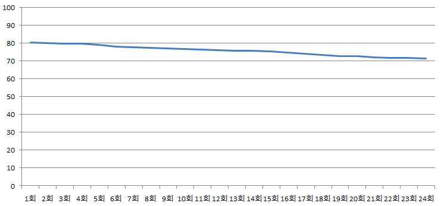
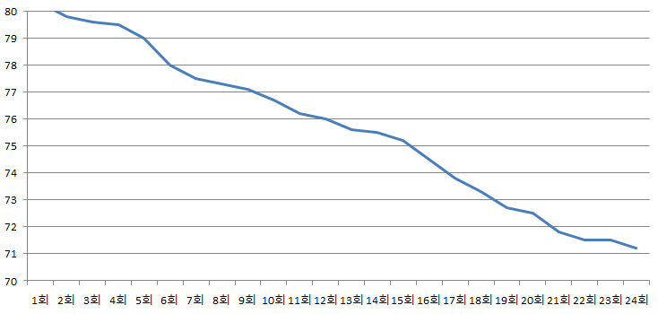

## 3강. 보이는 그대로 믿지 말자
### 퍼센트란
- `무엇`에 대한 퍼센트라고 표현할 때 `무엇`이 기준이 되며, 이 기준은 ` 퍼센트를 계산할 때 분모가 됨.  
- 한 마디로 두 개 이상의 숫자의 상대적 크기를 명확하게 하기 위한 개념이다.
- 다만 퍼센트는 이미 계산을 마치고, 받아들이면 된다는 것처럼 은연 중에 강요하기 때문에 퍼센트를 원래의 숫자를 `비교하는 정보`로서만 인식해야 한다.

### %p 와는 무슨 차이?
: %p는 퍼센트 비교시 기준이 같을 때, 두 퍼센트의 차이(혹은 변화)를 말한다.  
- EX : 2010년도 실업률이 2.1%, 2015년도 실업률이 3.1%일 때 맞는 표현은 각각 이렇게 된다.  
  \- 지난 5년 동안 실업률이 1%p 증가했다.  
  \- 지난 5년 동안 실업률이 48% 증가했다.  

### 시각화란
: 데이터 분석 결과인 숫자들이 나타내는 정보를 효과적으로 전달하기 위한 방법 중 하나로, 대표적으로 `그래프`가 있다.

### 그래프의 함정
#### 선 그래프의 함정  
- 예를 들어, 2년 간 월 1회씩 몸무게를 잰 사람의 몸무게 변화량 그래프가 있다고 쳤을 때, 아래 예시 그래프 처럼 세로축의 눈금만 달라져도 주는 인상이 크게 달라지게 된다.  

     

   
- 선 그래프의 `눈금이 촘촘`할 경우 상하의 변화가 심하고, `눈금이 촘촘하지 않을` 경우 변화가 완만하게 보인다.

#### 그래프의 공정성 평가
- 선 그래프 뿐만 아니라 막대 그래프, 그림 그래프, 원형 그래프 등 다양한 그래프에서 주관에 따라 실제 인상과는 다른 인상을 줄 수 있도록 왜곡이 가능하기에 그래프의 공정성 평가 능력이 요구된다.
- 그래프를 볼 땐 그래프가 **전체 그림을 보여주고** 있는지, **눈금이**(특히 수직축) **과장되어 있지 않은지**를 반문해보는 습관을 들여야한다.